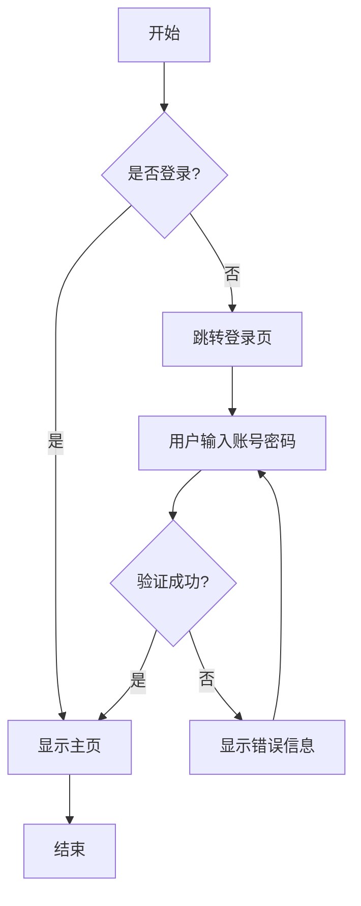
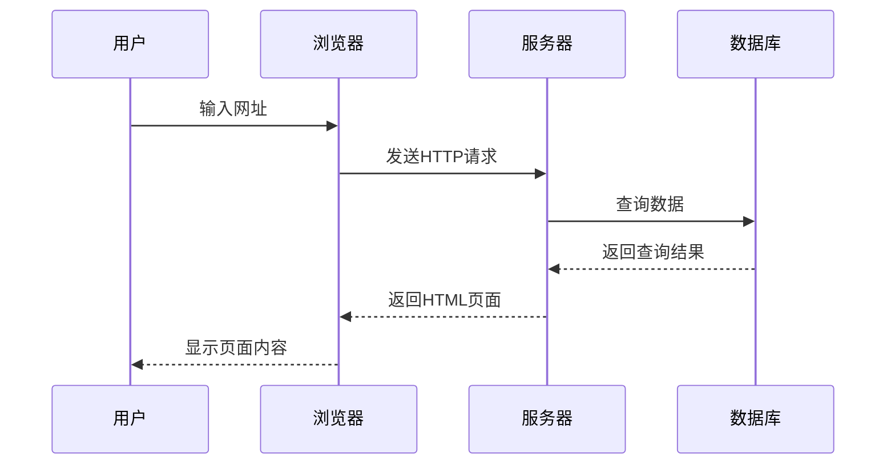
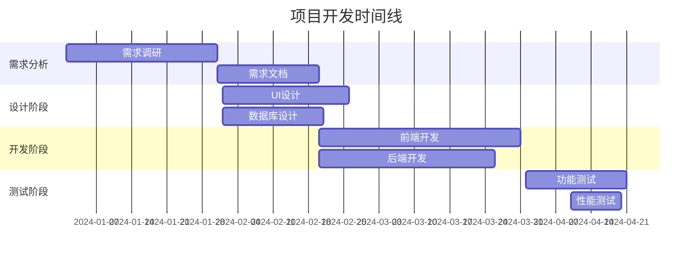
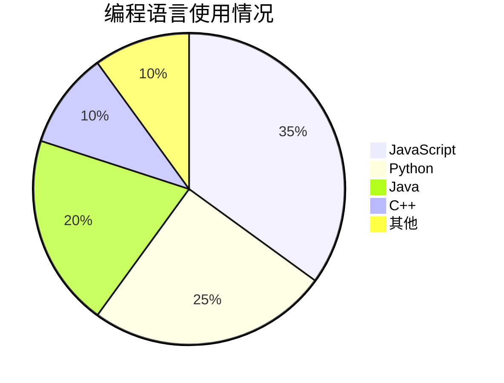

# Markdown转微信公众号工具 - 功能测试文档

这是一个全面的测试文档，展示了本工具支持的所有Markdown功能和微信公众号适配特性。

## 1. 基础文本格式

### 1.1 标题层级测试

# 一级标题 H1
## 二级标题 H2
### 三级标题 H3
#### 四级标题 H4
##### 五级标题 H5
###### 六级标题 H6

### 1.2 文本样式

这是**粗体文本**，这是*斜体文本*，这是***粗斜体文本***。

这是~~删除线文本~~，这是`行内代码`。

这是一段普通文本，用来测试段落的换行和间距效果。文本内容足够长，可以观察在不同屏幕尺寸下的显示效果。

## 2. 列表功能测试

### 2.1 无序列表

- 第一项
- 第二项
  - 嵌套项目 2.1
  - 嵌套项目 2.2
    - 深层嵌套 2.2.1
- 第三项

### 2.2 有序列表

1. 第一步
2. 第二步
   1. 子步骤 2.1
   2. 子步骤 2.2
3. 第三步

### 2.3 任务列表

- [x] 已完成的任务
- [x] 另一个已完成任务
- [ ] 待完成任务
- [ ] 另一个待完成任务

## 3. 引用和分割线

### 3.1 引用块

> 这是一个简单的引用。

> 这是一个多行引用。
>
> 第二段引用内容，测试引用块的样式效果。
>
> > 这是嵌套引用。

### 3.2 水平分割线

---

## 4. 链接和图片

### 4.1 链接测试

这是一个[内联链接](https://www.example.com)。

这是一个[带标题的链接](https://www.example.com "示例网站")。

### 4.2 图片测试


*注：实际使用时，请将图片上传到图床并替换链接*

## 5. 表格功能

### 5.1 基本表格

| 姓名 | 年龄 | 职业 |
|------|------|------|
| 张三 | 25 | 工程师 |
| 李四 | 30 | 设计师 |
| 王五 | 28 | 产品经理 |

### 5.2 对齐表格

| 左对齐 | 居中对齐 | 右对齐 |
|:-------|:--------:|-------:|
| 内容1  | 内容2    | 内容3  |
| 较长的内容 | 中等内容 | 短内容 |

## 6. 代码功能测试

### 6.1 行内代码

在JavaScript中，可以使用`console.log()`输出信息，使用`const`声明常量。

### 6.2 代码块测试

#### JavaScript 代码

```javascript
// JavaScript 示例代码
function fibonacci(n) {
    if (n <= 1) return n;
    return fibonacci(n - 1) + fibonacci(n - 2);
}

// 使用示例
const result = fibonacci(10);
console.log(`第10个斐波那契数是: ${result}`);

// ES6 箭头函数版本
const fibonacciArrow = (n) => n <= 1 ? n : fibonacciArrow(n - 1) + fibonacciArrow(n - 2);
```

#### Python 代码

```python
# Python 示例代码
def quicksort(arr):
    """快速排序算法实现"""
    if len(arr) <= 1:
        return arr

    pivot = arr[len(arr) // 2]
    left = [x for x in arr if x < pivot]
    middle = [x for x in arr if x == pivot]
    right = [x for x in arr if x > pivot]

    return quicksort(left) + middle + quicksort(right)

# 使用示例
numbers = [3, 6, 8, 10, 1, 2, 1]
sorted_numbers = quicksort(numbers)
print(f"排序结果: {sorted_numbers}")
```

#### HTML/CSS 代码

```html
<!DOCTYPE html>
<html lang="zh-CN">
<head>
    <meta charset="UTF-8">
    <title>示例页面</title>
    <style>
        .container {
            max-width: 800px;
            margin: 0 auto;
            padding: 20px;
        }
        .highlight {
            background-color: #f39c12;
            color: white;
            padding: 5px 10px;
            border-radius: 3px;
        }
    </style>
</head>
<body>
    <div class="container">
        <h1>欢迎使用</h1>
        <p class="highlight">这是高亮文本</p>
    </div>
</body>
</html>
```

#### SQL 代码

```sql
-- SQL 示例查询
SELECT
    u.id,
    u.username,
    u.email,
    COUNT(p.id) as post_count
FROM users u
LEFT JOIN posts p ON u.id = p.user_id
WHERE u.created_at >= '2023-01-01'
GROUP BY u.id, u.username, u.email
HAVING COUNT(p.id) > 5
ORDER BY post_count DESC
LIMIT 10;
```

## 7. 数学公式测试

### 7.1 行内数学公式

这是行内公式：$E = mc^2$，爱因斯坦的质能方程。

计算圆的面积：$A = \pi r^2$，其中 $r$ 是半径。

### 7.2 块级数学公式

二次方程的求解公式：

$$x = \frac{-b \pm \sqrt{b^2 - 4ac}}{2a}$$

矩阵运算示例：

$$\begin{pmatrix}
a & b \\
c & d
\end{pmatrix}
\begin{pmatrix}
x \\
y
\end{pmatrix}
=
\begin{pmatrix}
ax + by \\
cx + dy
\end{pmatrix}$$

### 7.3 复杂数学公式

积分公式：

$$\int_{a}^{b} f(x)dx = F(b) - F(a)$$

求和公式：

$$\sum_{n=1}^{\infty} \frac{1}{n^2} = \frac{\pi^2}{6}$$

## 8. 流程图测试

### 8.1 基本流程图



### 8.2 序列图



### 8.3 甘特图



### 8.4 饼图



## 9. 高级功能测试

### 9.1 脚注

这是一个带脚注的文本[^1]。

这里还有另一个脚注[^note]。

[^1]: 这是第一个脚注的内容。
[^note]: 这是命名脚注的内容，可以包含更多详细信息。

### 9.2 定义列表

HTTP
: 超文本传输协议，用于在Web上传输数据

HTML
: 超文本标记语言，用于创建网页结构

CSS
: 层叠样式表，用于控制网页的样式和布局

JavaScript
: 一种编程语言，用于为网页添加交互功能

## 10. 特殊字符和符号

### 10.1 常用符号

版权符号: ©
注册商标: ®
商标符号: ™
度数符号: 30°C
箭头符号: → ← ↑ ↓

### 10.2 数学符号

不等式: ≤ ≥ ≠ ≈ ∞
集合符号: ∈ ∉ ∪ ∩ ⊆ ⊇
逻辑符号: ∀ ∃ ¬ ∧ ∨

### 10.3 货币符号

美元: $100
欧元: €100
英镑: £100
日元: ¥100
人民币: ￥100

## 11. 代码语言支持测试

### 11.1 Go 语言

```go
package main

import (
    "fmt"
    "time"
)

func main() {
    // 创建一个通道
    ch := make(chan string, 2)

    // 启动协程
    go func() {
        time.Sleep(time.Second)
        ch <- "Hello"
    }()

    go func() {
        time.Sleep(time.Second * 2)
        ch <- "World"
    }()

    // 接收消息
    for i := 0; i < 2; i++ {
        msg := <-ch
        fmt.Println(msg)
    }
}
```

### 11.2 Rust 语言

```rust
use std::collections::HashMap;

fn main() {
    // 创建一个HashMap
    let mut scores = HashMap::new();
    scores.insert("Blue", 10);
    scores.insert("Yellow", 50);

    // 遍历HashMap
    for (key, value) in &scores {
        println!("{}: {}", key, value);
    }

    // 使用Option处理可能的空值
    match scores.get("Blue") {
        Some(score) => println!("蓝队得分: {}", score),
        None => println!("蓝队未找到"),
    }
}
```

### 11.3 JSON 数据

```json
{
  "name": "张三",
  "age": 30,
  "city": "北京",
  "skills": ["JavaScript", "Python", "React"],
  "contact": {
    "email": "zhangsan@example.com",
    "phone": "+86 138-0000-0000"
  },
  "active": true,
  "score": 85.5
}
```

### 11.4 YAML 配置

```yaml
# 应用配置
app:
  name: "我的应用"
  version: "1.0.0"
  debug: true

# 数据库配置
database:
  host: "localhost"
  port: 5432
  name: "myapp_db"
  credentials:
    username: "admin"
    password: "secret123"

# 服务器配置
server:
  port: 8080
  ssl: false
  middlewares:
    - "cors"
    - "helmet"
    - "compression"
```

## 12. 性能测试内容

### 12.1 长代码块测试

```python
# 这是一个较长的Python代码示例，用于测试代码高亮的性能
class DataProcessor:
    def __init__(self, data_source):
        self.data_source = data_source
        self.processed_data = []
        self.error_log = []

    def load_data(self):
        """加载数据"""
        try:
            with open(self.data_source, 'r', encoding='utf-8') as file:
                raw_data = file.readlines()
                return [line.strip() for line in raw_data if line.strip()]
        except FileNotFoundError:
            self.error_log.append(f"文件未找到: {self.data_source}")
            return []
        except Exception as e:
            self.error_log.append(f"数据加载错误: {str(e)}")
            return []

    def clean_data(self, raw_data):
        """清理数据"""
        cleaned = []
        for item in raw_data:
            # 移除特殊字符
            cleaned_item = ''.join(char for char in item if char.isalnum() or char.isspace())
            # 标准化空格
            cleaned_item = ' '.join(cleaned_item.split())
            if cleaned_item:
                cleaned.append(cleaned_item)
        return cleaned

    def transform_data(self, data):
        """转换数据"""
        transformed = []
        for item in data:
            # 转换为小写
            item = item.lower()
            # 分词
            words = item.split()
            # 过滤短词
            words = [word for word in words if len(word) > 2]
            if words:
                transformed.append(' '.join(words))
        return transformed

    def process(self):
        """处理数据的主方法"""
        print("开始数据处理...")

        # 加载数据
        raw_data = self.load_data()
        if not raw_data:
            print("没有数据可处理")
            return

        print(f"加载了 {len(raw_data)} 条记录")

        # 清理数据
        cleaned_data = self.clean_data(raw_data)
        print(f"清理后剩余 {len(cleaned_data)} 条记录")

        # 转换数据
        self.processed_data = self.transform_data(cleaned_data)
        print(f"转换后得到 {len(self.processed_data)} 条记录")

        print("数据处理完成！")

        if self.error_log:
            print("处理过程中发生的错误:")
            for error in self.error_log:
                print(f"  - {error}")

    def save_results(self, output_file):
        """保存处理结果"""
        try:
            with open(output_file, 'w', encoding='utf-8') as file:
                for item in self.processed_data:
                    file.write(item + '\n')
            print(f"结果已保存到: {output_file}")
        except Exception as e:
            print(f"保存失败: {str(e)}")

# 使用示例
if __name__ == "__main__":
    processor = DataProcessor("input_data.txt")
    processor.process()
    processor.save_results("output_data.txt")
```

### 12.2 长数学公式测试

贝叶斯定理的完整表述：

$$P(A_i|B) = \frac{P(B|A_i)P(A_i)}{\sum_{j=1}^{n}P(B|A_j)P(A_j)}$$

麦克劳林级数展开：

$$e^x = \sum_{n=0}^{\infty} \frac{x^n}{n!} = 1 + x + \frac{x^2}{2!} + \frac{x^3}{3!} + \frac{x^4}{4!} + \cdots$$

傅里叶变换：

$$F(\omega) = \int_{-\infty}^{\infty} f(t) e^{-i\omega t} dt$$

## 13. 微信兼容性测试

### 13.1 特殊格式测试

这段文本包含了**粗体**、*斜体*、`行内代码`和~~删除线~~等多种格式的组合。

### 13.2 长段落测试

这是一个很长的段落，用来测试在微信公众号中的显示效果。段落中包含了各种标点符号：句号。逗号，分号；冒号：感叹号！问号？引号""''等。这个段落的目的是测试文本的折行、间距和整体的阅读体验，确保在微信公众号的编辑器中能够正确显示，同时保持良好的可读性。

## 14. 总结

这个测试文档涵盖了Markdown转微信公众号工具的所有主要功能：

✅ **基础Markdown语法**: 标题、文本样式、列表、链接、图片
✅ **高级功能**: 表格、代码高亮、数学公式、流程图
✅ **图片处理**: 支持拖拽上传和剪贴板粘贴
✅ **多种模板**: 极简、技术、学术三种风格
✅ **导出功能**: HTML和ZIP格式导出
✅ **微信适配**: 样式内联化，兼容公众号编辑器

---

**使用说明**：
1. 将此文档内容复制到编辑器中进行测试
2. 尝试切换不同的样式模板查看效果
3. 测试图片拖拽和粘贴功能
4. 使用导出功能生成HTML或ZIP文件
5. 将生成的内容复制到微信公众号编辑器中验证兼容性

*最后更新时间：2024年1月*